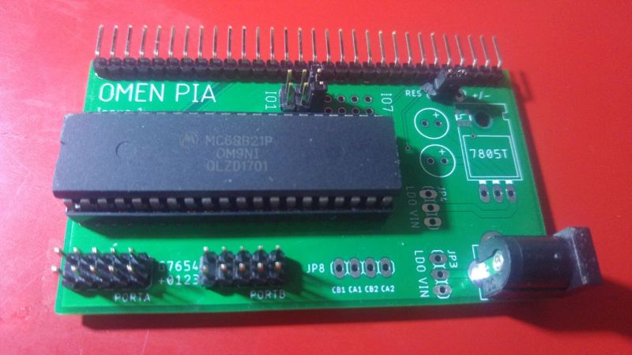
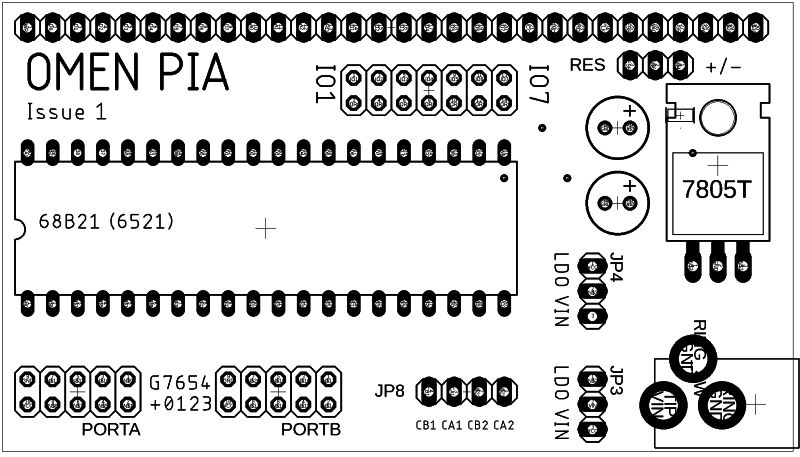

#OMEN PIA

Two 8bit serial port, designed for the [OMEN Computers](//github.com/osmibity/) with the system bus (Alpha, Bravo, Kilo, ...)

It uses the Motorola 68B21 PIA chip, or its 65xx equivalent 6521 (available from the WDC as [W65C21](http://westerndesigncenter.com/wdc/w65c21-chip.cfm)).

Board allows some options:

- Power supply
  - Direct supply for 5 V
  - Voltage regulator for supply 7 - 12 V
- RESET invertor (OMEN Alpha has positive RESET, others have inverted /RESET)
- IO selector (you can select IO1 to IO7 using simple switch)

## Parts

- Motorola MC68B21 or equivalent (W65C21, R6521 etc)
- IO socket DIL, 40 pin, wide
- Pin headers for the OMEN Bus, IO switch, port data pins
- Switches for LDO and RESET polarity
- (Optionally) 7805 LDO voltage regulator + 2x capacitor 10M
- (Optionally) SMD invertor 74AHC1G04D for reverting the RESET polarity

## Usage

Select the right IOx address space. For addresses value of each IOx, consult your OMEN manual.

See [datasheet](docs/datasheet) to further detail about programming.

## Ports

Ports are connected to 2x5 pin header each. 

Each header has 8 data pin, Vcc and GND.

Special header JP8 has connected the CA1, CA2, CB1 and CB2 control pins.

### RESET circuit

For Kilo, Bravo etc. with inverted RESET, just connect RES pin "+" (1-2)
For Alpha: Solder the invertor 74AHC1G04D and connect RES pin "-" (2-3)
Alpha hack: just solder a wire between the middle pin of RES switch and VCC (e.g. pin 20 of PIA IC)

### Power circuit

If you have the regulated voltage supply 5V, you can connect it directly here. Please use two switches (JP3, JP4), both on "VIN" position. *CAUTION! Supply input is connected directly to the system Vcc, so leave the supply input on the CPU board not connected!*

You can use the place for the 7805 regulator (up to 2 A). Solder the regulator and tvo capacitors, and select option "LDO" on both switches JP3, JP4. Connect power supply 7 - 12 V. Use heat sink for the regulator!

If you does not use the dedicated power supply, just leave both switches open and omit the power supply connector, voltage regulator as well as both capacitors.

## System bus pinout

| Pin | Signal
| --- | ---
| 1  | /WR
| 2  | D0
| 3  | D1
| 4  | D2
| 5  | D3
| 6  | D4
| 7  | D5
| 8  | D6
| 9  | D7
| 10 |  A0
| 11 |  A1
| 12 |  A2 (not connected in OMEN PIA)
| 13 |  /RD
| 14 |  IO1 (active low)
| 15 |  IO2
| 16 |  IO3
| 17 |  IO4
| 18 |  IO5
| 19 |  IO6
| 20 |  IO7
| 21 |  Vcc
| 22 |  GND
| 23 |  IRQ (not connected in OMEN PIA)
| 24 |  Clock
| 25 |  /RESET
| 26 |  /WAIT (not connected in OMEN PIA)
| 27 |  /BUSRQ (not connected in OMEN PIA)
| 28 |  /BUSACK (not connected in OMEN PIA)
| 29 |  (Reserved for future use)
| 30 |  (Reserved for future use)

### License

[CERN OHL](LICENSE.txt)